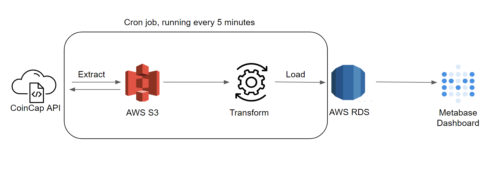

# Crypto Exchange Data Pipeline with Python and AWS

## Overview
* Extracts and transform crypto data with Python from CoinCap Api 
* Data is loaded into AWS S3 and then transferred to an AWS RDS Postgres instance and then rendered by Metabase
* Python code runs on a scheduled Cloudwatch event which trigger AWS Lambda function call every 5 minutes

# Important Links
* [Visualization](http://52.9.82.201:3000/public/dashboard/2267c6ea-e60f-4c59-9e98-b3d673c1df3e)

## How the Pipeline Works

### Tools  
| AWS  | API | Visualization |
| -----|------- | ----- |
| RDS  | CoinCap | Metabase|
| S3  | | Docker |
|EC2| | |
|Lambda| | |
