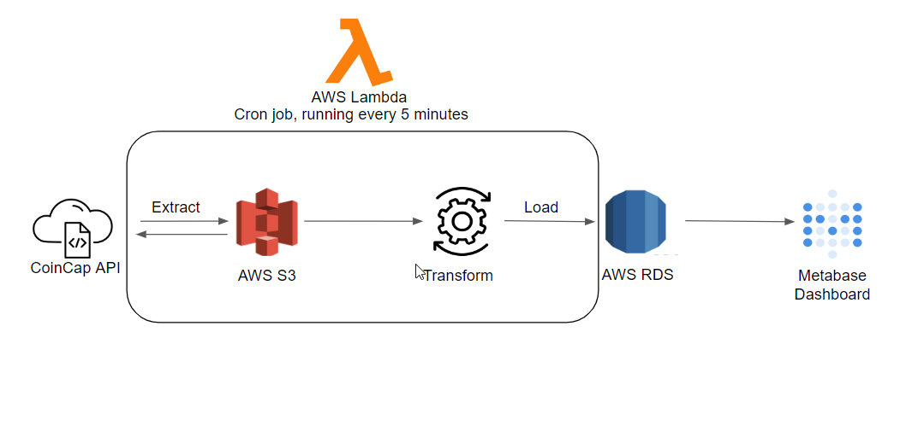

# Crypto Exchange Data Pipeline with Python and AWS

## Overview
* Extracts and transform crypto data with Python from CoinCap Api 
* Data is loaded into AWS S3 and then transferred to an AWS RDS Postgres instance and then rendered by Metabase
* Python code runs on a scheduled Cloudwatch event which trigger AWS Lambda function call every 5 minutes

# Important Links
* [Visualization](https://dashboard.orlandomoya.com/public/dashboard/691a60a6-cb3c-474e-8062-55061ec21e9f)

## How the Pipeline Works
1. A CloudWatch event triggers `lambda_function.py` to run every 2 hours.
2. `lambda_function.py` calls `etl_extract.py` which pulls data from CoinCap api.
3. Data is loaded to a S3 bucket and then `etl_load.py` transfroms and loads the data to a Postgres instance on RDS.
4. A Metabase instance running on a VM hosted by EC2 displays the data on a dashboard.
   
### Tools  
| AWS  | API | Visualization |
| -----|------- | ----- |
| RDS  | CoinCap | Metabase|
| S3  | | Docker |
|EC2| | |
|Lambda| | |
